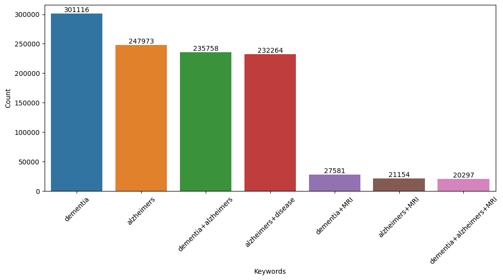

# 👨🏻‍💻🧠👨‍🔬 Hitesh Pradhan

[](https://twitter.com/intent/follow?screen_name=pradhitesh)
[](https://www.linkedin.com/in/pradhanhitesh/)
[](mailto:ihiteshpradhan@gmail.com)

Passionate neuroscientist dedicated to unraveling neurodegenerative diseases, particularly Alzheimer's. From a chance
encounter with "Alzheimer's" in 2016, I've evolved into a committed researcher. My expertise lies in developing early AD
prediction frameworks, utilizing neuroimaging and explainable AI models. **Currently, at the Centre for Brain Research,
I explore population-level dynamics in rural India, decoding brain pathological changes associated with amnestic mild
cognitive impairment**. Join me in this exciting journey as we make a lasting impact on dementia research.

🔨 I am currently ..
```yaml
1. Developing 3D brain MRI transformation techniques for efficient CNN models
2. Working on brain-age prediction models for early biomarkers of dementia
```

<!-- START OF PROFILE STACK, DO NOT REMOVE -->
| 💻 **Projects** | 🚀 **Outcome**
| - | - |
|[](https://github.com/pradhanhitesh/FENS-JobsAlert)|Weekly email blasts consisting job posting collected from FENS |
|[](https://github.com/pradhanhitesh/3D-MRI-Transformations)|Working on collecting research-based 3D MRI transformation techniques|
|[](https://github.com/pradhanhitesh/neuroimage-plugins)|Small plugins to make neuroimaging analysis workflow efficient|
<!-- END OF PROFILE STACK, DO NOT REMOVE -->

<h1 align="center">Visualization of PubMed Article Counts</h1>

<p>Dementia, a prevalent cognitive disorder affecting millions globally, demands extensive research and attention due to
    its profound impact on individuals, families, and societies. As the global population continues to age,
    understanding the mechanisms, risk factors, and potential treatments for dementia becomes increasingly urgent.
    Extensive research is essential to unravel the complex biological, genetic, and environmental factors contributing
    to the onset and progression of dementia. This research can illuminate pathways for early detection, intervention,
    and prevention strategies. Moreover, it can lead to the development of targeted therapies that may alleviate
    symptoms or slow the progression of the condition.</p>

<p>The section collects number of articles indexed under particular keyword from <a
        href="https://pubmed.ncbi.nlm.nih.gov/">PubMed</a> everyday using GitHub actions. As of <b> 2025-02-26 17:05:54 </b>
    IST, number of articles indexed for the following keywords are as follows:</p>

<p align="center">
    
</p>